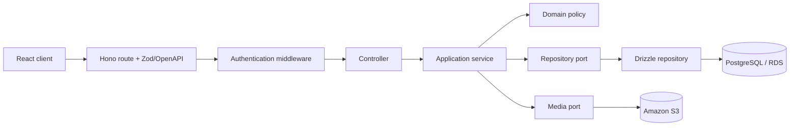
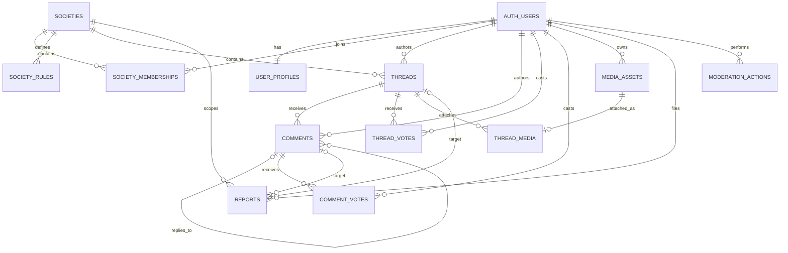

# Backend architecture and data model

Status: accepted design baseline  
Scope: RMIT Society MVP  
Runtime: Node.js 22, Hono, TypeScript, Drizzle ORM, PostgreSQL on Amazon RDS

## 1. Decision summary

Use a **domain-oriented modular monolith** with this dependency flow:

```text
HTTP route → Controller → Application service → Repository port → Drizzle repository → PostgreSQL
                              ↓
                        Domain model/policy
```

This is pragmatic DDD, not microservices. One deployable API keeps coursework deployment, transactions, cost, and live-demo operations simple. Module boundaries preserve a later extraction path if measured scale requires it.

Core rules:

1. Controllers own HTTP concerns only.
2. Services own use cases, authorization, orchestration, and transaction boundaries.
3. Domain code owns business rules and has no Hono, Drizzle, AWS SDK, or PostgreSQL imports.
4. Repository ports describe persistence needed by services; Drizzle implementations remain infrastructure details.
5. Modules communicate through public application interfaces, never another module's tables or controller.
6. `app.ts`/bootstrap is the composition root and injects concrete dependencies.

## 2. Bounded contexts

| Context           | Responsibilities                                                                                             | Initial services                                                |
| ----------------- | ------------------------------------------------------------------------------------------------------------ | --------------------------------------------------------------- |
| Identity & Access | Registration eligibility, authentication adapter, sessions, profiles, platform suspension, system-admin role | `AuthService`, `UserService`, `AdminUserService`                |
| Societies         | Society lifecycle, discovery, membership, rules, society-scoped moderator assignment                         | `SocietyService`, `MembershipService`                           |
| Discussions       | Threads, comments, media attachment references, voting, feed queries                                         | `ThreadService`, `CommentService`, `VoteService`, `FeedService` |
| Moderation        | Reports, moderation queue, resolution, immutable action history                                              | `ReportService`, `ModerationService`                            |
| Media             | S3 upload authorization, object metadata, upload completion, deletion                                        | `MediaService`                                                  |
| Operations        | Health/readiness and later operational endpoints                                                             | existing health handlers                                        |

A moderator is **not** a global user role. Moderator authority comes from an active `society_memberships` row with role `moderator`. `system_admin` is a platform role.

## 3. Source structure

```text
backend/src/
├── app.ts                         # HTTP composition and global middleware
├── server.ts                      # process lifecycle
├── config/
├── db/
│   ├── client.ts
│   └── schema.ts                  # schema export barrel for Drizzle Kit
├── shared/
│   ├── application/               # pagination, clock, transaction abstractions
│   ├── domain/                    # shared IDs/errors only when truly cross-context
│   ├── infrastructure/            # shared Drizzle/AWS adapters
│   └── presentation/              # error envelope and principal middleware
└── modules/
    └── societies/
        ├── domain/
        │   ├── society.ts
        │   ├── membership.ts
        │   └── society.errors.ts
        ├── application/
        │   ├── society.service.ts
        │   ├── membership.service.ts
        │   ├── society.repository.ts       # port/interface
        │   └── society.dto.ts              # framework-neutral commands/results
        ├── infrastructure/
        │   ├── society.tables.ts
        │   └── drizzle-society.repository.ts
        ├── presentation/
        │   ├── society.controller.ts
        │   ├── society.routes.ts
        │   └── society.schemas.ts          # Zod/OpenAPI transport schemas
        └── index.ts                         # module factory/public surface
```

Repeat module shape only where needed. Small capabilities may share one service or repository; do not create empty layers or one class per CRUD operation.

### Layer responsibilities

| Layer           | May know                                                               | Must not do                                             |
| --------------- | ---------------------------------------------------------------------- | ------------------------------------------------------- |
| Route           | Hono route registration, middleware ordering, OpenAPI metadata         | Business logic or SQL                                   |
| Controller      | HTTP input/output, Zod result, authenticated principal, status mapping | Query Drizzle, start transactions, decide authorization |
| Service         | Commands/queries, policies, authorization, transaction orchestration   | Depend on Hono context or return HTTP responses         |
| Domain          | Entities, value objects, invariants, domain errors                     | Import framework, ORM, or AWS code                      |
| Repository port | Domain-oriented reads/writes required by a service                     | Expose generic ORM/query-builder APIs                   |
| Infrastructure  | Drizzle queries, PostgreSQL constraints, S3 and auth adapters          | Decide use-case policy or format HTTP responses         |

Controllers should be factory functions with injected services unless a class adds real value. Services may be classes or closures, but dependencies must be explicit and testable.

## 4. Request and dependency model



Authentication middleware creates a framework-neutral principal:

```ts
interface RequestPrincipal {
  readonly userId: string;
  readonly platformRole: "student" | "system_admin";
}
```

Controllers pass this principal into services. Services enforce ownership, membership, moderator scope, suspension, and admin policy. Frontend route guards are never authorization controls.

## 5. Database conventions

- PostgreSQL names: `snake_case`, plural table names.
- IDs: application-generated UUIDs; never expose sequential IDs.
- Time: `timestamptz`, stored in UTC.
- Email: trim and lowercase before persistence; enforce case-insensitive uniqueness in PostgreSQL.
- Mutable rows: `created_at` and `updated_at`.
- User content: soft deletion/status transitions; avoid destructive cascades that erase moderation evidence.
- Join tables: composite primary key where relationship itself is identity.
- Money is absent. Vote values use `smallint` constrained to `-1` or `1`.
- S3 files never enter PostgreSQL; persist object key and metadata only.
- JSONB is allowed for immutable audit metadata, not core relationships or fields that need filtering.
- Every foreign key receives an explicit delete policy.
- Add indexes from concrete query paths; avoid speculative indexing.
- Drizzle table definitions live with owning module infrastructure. `src/db/schema.ts` re-exports them for Drizzle Kit.
- Migrations are generated with Drizzle Kit, reviewed, committed, and applied by tooling. Never hand-edit generated migration metadata.

## 6. Logical schema

### 6.1 Identity & Access

Authentication-provider tables (`users`, `sessions`, `accounts`, and verification records) remain owned by the Identity infrastructure adapter. Final physical names and required columns must be confirmed when the authentication adapter is implemented; application services must not query session tables directly.

Application-owned profile fields:

#### `user_profiles`

| Column            | Type         | Rules                                                     |
| ----------------- | ------------ | --------------------------------------------------------- |
| `user_id`         | uuid         | PK; FK auth user; restricted hard delete                  |
| `display_name`    | varchar(80)  | required, trimmed                                         |
| `bio`             | varchar(500) | nullable                                                  |
| `avatar_media_id` | uuid         | nullable FK `media_assets.id`; set null on media deletion |
| `platform_role`   | text         | `student` or `system_admin`; default `student`            |
| `status`          | text         | `active`, `suspended`, or `deactivated`                   |
| `suspended_until` | timestamptz  | nullable; null may mean indefinite suspension             |
| `created_at`      | timestamptz  | required                                                  |
| `updated_at`      | timestamptz  | required                                                  |

Auth user email must have a case-insensitive unique index. Registration must fail closed when approved RMIT domain configuration is empty.

### 6.2 Societies

#### `societies`

| Column        | Type          | Rules                         |
| ------------- | ------------- | ----------------------------- |
| `id`          | uuid          | PK                            |
| `slug`        | varchar(64)   | unique; normalized lowercase  |
| `name`        | varchar(100)  | required                      |
| `description` | varchar(1000) | required                      |
| `status`      | text          | `active` or `archived`        |
| `created_by`  | uuid          | FK auth user; restrict delete |
| `created_at`  | timestamptz   | required                      |
| `updated_at`  | timestamptz   | required                      |

Indexes: unique `slug`; `(status, name)` for discovery.

#### `society_memberships`

| Column       | Type        | Rules                         |
| ------------ | ----------- | ----------------------------- |
| `society_id` | uuid        | FK `societies`; composite PK  |
| `user_id`    | uuid        | FK auth user; composite PK    |
| `role`       | text        | `member` or `moderator`       |
| `status`     | text        | `active`, `left`, or `banned` |
| `joined_at`  | timestamptz | required                      |
| `updated_at` | timestamptz | required                      |
| `banned_by`  | uuid        | nullable FK auth user         |
| `banned_at`  | timestamptz | nullable                      |

Indexes: `(user_id, status)` for personal society index; `(society_id, role, status)` for moderator checks.

#### `society_rules`

| Column        | Type         | Rules                                                          |
| ------------- | ------------ | -------------------------------------------------------------- |
| `id`          | uuid         | PK                                                             |
| `society_id`  | uuid         | FK `societies`; cascade only when society is physically purged |
| `position`    | smallint     | positive; unique within society                                |
| `title`       | varchar(100) | required                                                       |
| `description` | varchar(500) | required                                                       |
| `created_at`  | timestamptz  | required                                                       |
| `updated_at`  | timestamptz  | required                                                       |

### 6.3 Discussions

#### `threads`

| Column          | Type         | Rules                                                 |
| --------------- | ------------ | ----------------------------------------------------- |
| `id`            | uuid         | PK                                                    |
| `society_id`    | uuid         | FK `societies`; restrict delete                       |
| `author_id`     | uuid         | FK auth user; restrict delete                         |
| `title`         | varchar(300) | required                                              |
| `body`          | text         | nullable after author deletion/moderation             |
| `status`        | text         | `published`, `removed`, or `deleted`                  |
| `score`         | integer      | denormalized vote total; default `0`                  |
| `comment_count` | integer      | denormalized visible count; default `0`, non-negative |
| `created_at`    | timestamptz  | required                                              |
| `updated_at`    | timestamptz  | required                                              |
| `deleted_at`    | timestamptz  | nullable                                              |

Indexes: `(society_id, status, created_at desc, id desc)` for society feed; `(author_id, created_at desc)`; `(status, created_at desc, id desc)` for global feed.

#### `comments`

| Column       | Type        | Rules                                |
| ------------ | ----------- | ------------------------------------ |
| `id`         | uuid        | PK                                   |
| `thread_id`  | uuid        | FK `threads`; restrict delete        |
| `author_id`  | uuid        | FK auth user; restrict delete        |
| `parent_id`  | uuid        | nullable self-FK                     |
| `body`       | text        | nullable after deletion/removal      |
| `status`     | text        | `published`, `removed`, or `deleted` |
| `score`      | integer     | denormalized vote total; default `0` |
| `created_at` | timestamptz | required                             |
| `updated_at` | timestamptz | required                             |
| `deleted_at` | timestamptz | nullable                             |

Indexes: `(thread_id, created_at, id)`; `(parent_id, created_at, id)`. Repository/service must ensure parent comment belongs to same thread. MVP may cap nesting depth in domain policy.

#### `thread_votes`

| Column       | Type        | Rules                      |
| ------------ | ----------- | -------------------------- |
| `thread_id`  | uuid        | FK `threads`; composite PK |
| `user_id`    | uuid        | FK auth user; composite PK |
| `value`      | smallint    | check `value in (-1, 1)`   |
| `created_at` | timestamptz | required                   |
| `updated_at` | timestamptz | required                   |

#### `comment_votes`

Same shape as `thread_votes`, replacing `thread_id` with `comment_id`. Separate vote tables retain real foreign keys and prevent polymorphic-target corruption.

### 6.4 Media

#### `media_assets`

| Column         | Type         | Rules                                           |
| -------------- | ------------ | ----------------------------------------------- |
| `id`           | uuid         | PK                                              |
| `owner_id`     | uuid         | FK auth user; restrict delete                   |
| `object_key`   | varchar(512) | unique; never store presigned or delivery URL |
| `purpose`      | text         | initially `thread_attachment` or `avatar`       |
| `content_type` | varchar(100) | allow-listed by service                         |
| `byte_size`    | bigint       | positive and bounded by purpose                 |
| `checksum`     | varchar(128) | nullable until upload completion                |
| `status`       | text         | `pending`, `ready`, `quarantined`, or `deleted` |
| `created_at`   | timestamptz  | required                                        |
| `completed_at` | timestamptz  | nullable                                        |
| `deleted_at`   | timestamptz  | nullable                                        |

#### `thread_media`

| Column      | Type     | Rules                                      |
| ----------- | -------- | ------------------------------------------ |
| `thread_id` | uuid     | FK `threads`; composite PK                 |
| `media_id`  | uuid     | FK `media_assets`; unique and composite PK |
| `position`  | smallint | non-negative; unique within thread         |

Only `ready` assets owned by thread author may be attached. Client upload flow is `request upload → PUT directly to S3 → complete upload → attach asset`.

### 6.5 Moderation

#### `reports`

| Column            | Type          | Rules                                              |
| ----------------- | ------------- | -------------------------------------------------- |
| `id`              | uuid          | PK                                                 |
| `society_id`      | uuid          | FK `societies`; queue scope                        |
| `reporter_id`     | uuid          | FK auth user                                       |
| `thread_id`       | uuid          | nullable FK `threads`                              |
| `comment_id`      | uuid          | nullable FK `comments`                             |
| `reason`          | text          | controlled reason code                             |
| `details`         | varchar(1000) | nullable                                           |
| `status`          | text          | `pending`, `in_review`, `resolved`, or `dismissed` |
| `assigned_to`     | uuid          | nullable FK auth user                              |
| `resolution`      | text          | nullable controlled outcome                        |
| `resolution_note` | varchar(1000) | nullable                                           |
| `created_at`      | timestamptz   | required                                           |
| `updated_at`      | timestamptz   | required                                           |
| `resolved_at`     | timestamptz   | nullable                                           |
| `resolved_by`     | uuid          | nullable FK auth user                              |

Constraint: exactly one of `thread_id` and `comment_id` is non-null. Service verifies target belongs to `society_id`. Add partial unique indexes preventing duplicate active reports by the same reporter for the same target.

Indexes: `(society_id, status, created_at, id)` for moderation queue; `(reporter_id, created_at desc)`.

#### `moderation_actions`

Append-only audit record.

| Column        | Type          | Rules                                                  |
| ------------- | ------------- | ------------------------------------------------------ |
| `id`          | uuid          | PK                                                     |
| `society_id`  | uuid          | nullable; null only for platform-admin action          |
| `actor_id`    | uuid          | FK auth user                                           |
| `action`      | text          | controlled action code                                 |
| `target_type` | text          | `user`, `membership`, `thread`, `comment`, or `report` |
| `target_id`   | uuid          | required audit reference                               |
| `reason`      | varchar(1000) | required                                               |
| `metadata`    | jsonb         | non-authoritative context only; default `{}`           |
| `created_at`  | timestamptz   | required; never updated                                |

Indexes: `(society_id, created_at desc)` and `(target_type, target_id, created_at desc)`.

## 7. Relationship overview



## 8. Critical invariants and transaction boundaries

### Registration

- Normalize email before checking uniqueness.
- Validate domain against reviewed configuration.
- Reject registration when allow-list is empty.
- Create auth identity and profile atomically where adapter support permits; compensate safely otherwise.

### Society membership and moderation

- Only active members may create threads, comments, or votes in a society.
- Only active society moderators or system admins may moderate that society.
- A society must retain at least one active moderator before removing/demoting a moderator.
- System-admin society creation is MVP default until product decision changes.

### Voting

One transaction must lock/read prior vote, insert/update/delete vote, and apply score delta to target. Repeating the same command is idempotent. `value = 0` means remove vote at service/API level and is never stored.

### Comments

Create comment and increment `threads.comment_count` in one transaction. Delete/remove transitions preserve row identity so child replies and reports remain valid.

### Reports

Create only against visible or retained moderated content. Claiming a report uses a conditional update so two moderators cannot own it concurrently. Resolution, content/member state change, and `moderation_actions` insert occur in one transaction.

### Media

Presign only allow-listed content types and bounded sizes. Generate object keys server-side. Completion verifies object metadata before setting `ready`. Database stores key, never binary content or temporary URL.

## 9. API conventions

Base path: `/api/v1`.

- JSON uses `camelCase`; PostgreSQL uses `snake_case`.
- Controllers validate path, query, and body with named Zod schemas used by OpenAPI.
- Collection endpoints use cursor pagination. Cursor includes stable sort value plus UUID tie-breaker; do not expose raw offset for changing feeds.
- Mutations return resource representation or `204`; avoid success booleans.
- Vote endpoints use `PUT` because setting vote state is idempotent.
- All errors use one envelope:

```json
{
  "error": {
    "code": "SOCIETY_FORBIDDEN",
    "message": "You cannot moderate this society",
    "requestId": "request-id",
    "details": {}
  }
}
```

Domain errors map centrally to stable status/code pairs. Unexpected errors return no internals.

Initial route groups:

```text
/api/v1/auth/*
/api/v1/users/me
/api/v1/societies
/api/v1/societies/:societyId/membership
/api/v1/societies/:societyId/rules
/api/v1/societies/:societyId/threads
/api/v1/threads/:threadId
/api/v1/threads/:threadId/comments
/api/v1/threads/:threadId/vote
/api/v1/comments/:commentId
/api/v1/comments/:commentId/vote
/api/v1/reports
/api/v1/mod/societies/:societyId/reports
/api/v1/mod/reports/:reportId
/api/v1/admin/users
/api/v1/media/uploads
/api/v1/health/*
```

Use IDs for writes and stable resource identity. Society slug may be accepted for human-facing reads, then resolved once in repository/service.

Analytics action reads use `/api/v2/admin/analytics` and are restricted to
system administrators. The contract exposes additive activity, authoritative
current-state, and reconciliation metric kinds at platform, society, and
content grains. Refresh requests are durable, range-scoped, and coalesced by
the workflow service; controllers do not contain metric or authorization
rules.

## 10. Testing strategy

- **Domain tests:** pure invariant/policy tests; no database or Hono.
- **Service tests:** mocked/fake ports; verify authorization, orchestration, transaction use, and domain error behavior.
- **Repository integration tests:** real PostgreSQL matching production major version; verify constraints, indexes/query semantics, and transaction concurrency.
- **Controller tests:** `app.request`; verify validation, auth principal mapping, status codes, response shape, and OpenAPI registration.
- **Workflow tests:** registration/sign-in, society participation, report resolution, and media upload completion.

Do not mock Drizzle to prove SQL correctness. Unit-test services through repository ports, then integration-test concrete repositories against PostgreSQL.

## 11. Implementation sequence

1. Add shared error/principal/transaction contracts and module registration pattern.
2. Implement Identity adapter and authenticated principal middleware.
3. Implement Society tables, repository, services, and controllers.
4. Implement Threads and Comments.
5. Implement Votes with transactional score updates.
6. Implement Reports and Moderation audit workflow.
7. Implement S3 media lifecycle and thread attachments.
8. Add admin operations, demo seed data, and architecture evidence.
9. Implement analytics action events, Glue export, Athena aggregates, and the
   versioned admin API after the user-visible workflow is approved.

Each slice should include schema migration, repository integration tests, service tests, controller/OpenAPI tests, and documentation update.

## 12. Decisions still requiring confirmation

- Exact RMIT AU, VN, and EU registration-domain allow-list.
- Authentication adapter configuration and its physical table mapping.
- Maximum comment nesting depth.
- Allowed media MIME types and size limits.
- Whether students may request/create societies; MVP assumes system-admin creation.
- Analytics is implemented through the v2 action-event contract and the
  existing Glue/Athena workflow; contract retention and recording-start
  boundaries remain deployment configuration.
